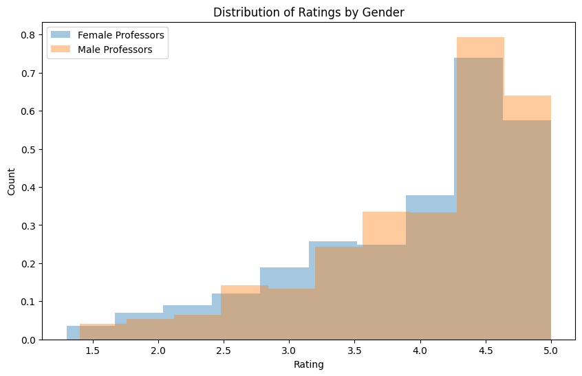

# Rate-My-Professor-Analysis

## Overview
This project answers various questions about instructors using Rate My Professors data. EDA and feature engineering is completed on the dataset before begin used to answer 10 questions. Linear and logistic regression models are implemented along with bootstrapping methods to understand effect sizes.

---

# Research Questions
Through this project I am to answer the following:
- Is there bias towards male professors?
- What are the size of gender effects in the data?
- Is there a difference in difficulty ratings by gender?
- Can we design effective regression models to predict professor ratings?

# Data Description
- **Data Source:** Rate My Professor
- **Key Variables:**
  - Average Rating
  - Average Difficulty
  - Gender
  - Number of Ratings
  - Would Take Again

---

# Data Preprocessing
To begin, I remove professors that have an extremely small number of ratings, as their reviews would not be truly representative of their performance. Next, there is ambiguity in the gender column where a professor's gender could not be determined from their name alone (hence male & female == 1 OR male & female == 0). As there were only a few instances where this occured, and it could affect analysis/model prediction later, I removed these professors from the cleaned dataframe. I also normalized the tags columns by dividing by the number of ratings the professor received because a professor with more ratings would naturally have an inflated number of tags given.

---

# Question highlights

To determine if there is bias towards male professors being rated higher than female professors, I performed a one-sided Mann-Whitney U-test on professor ratings. This test uses the assumptions that groups are independent and ratings are ordinal, where the distance between ratings is not precisely the same.
A p-value of 0.00273 was found, which is lower than our chosen alpha level of 0.005 so I rejected the null hypothesis that male professors are not rated higher than female professors. This suggests a statistically significant difference in the distributions of average ratings by gender that would be unlikely due to chance alone.

---

To quantify the likely size of the effect of gender bias in average ratings, I used cohen's d along with boostrapping at a 95% confidence level.
